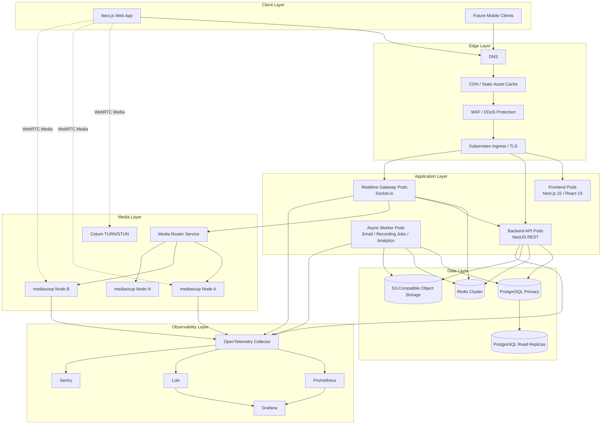
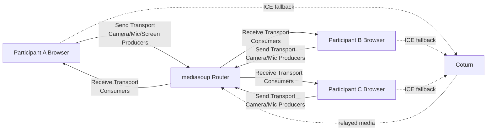
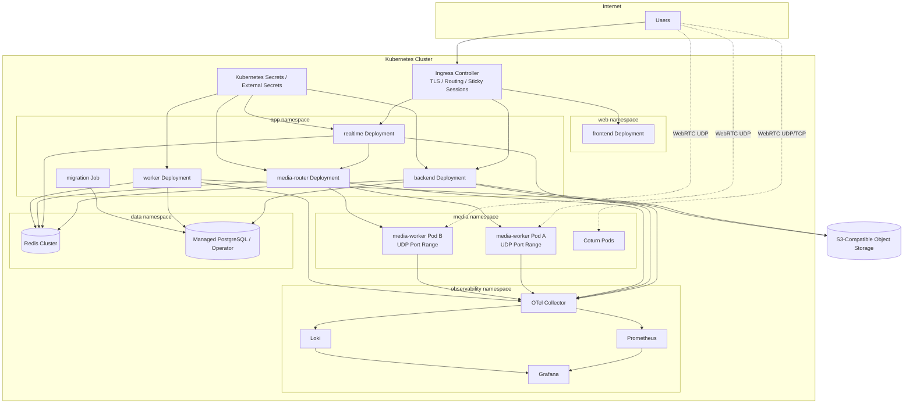
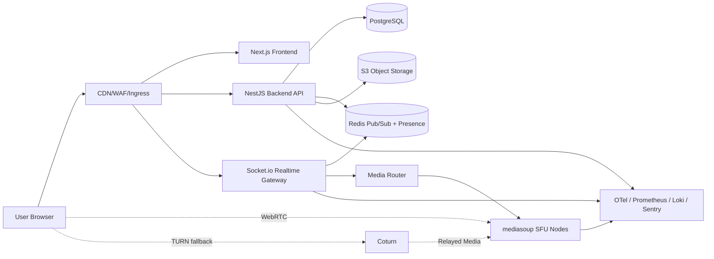
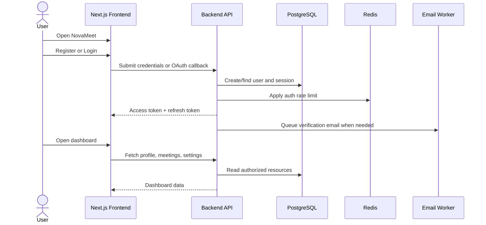
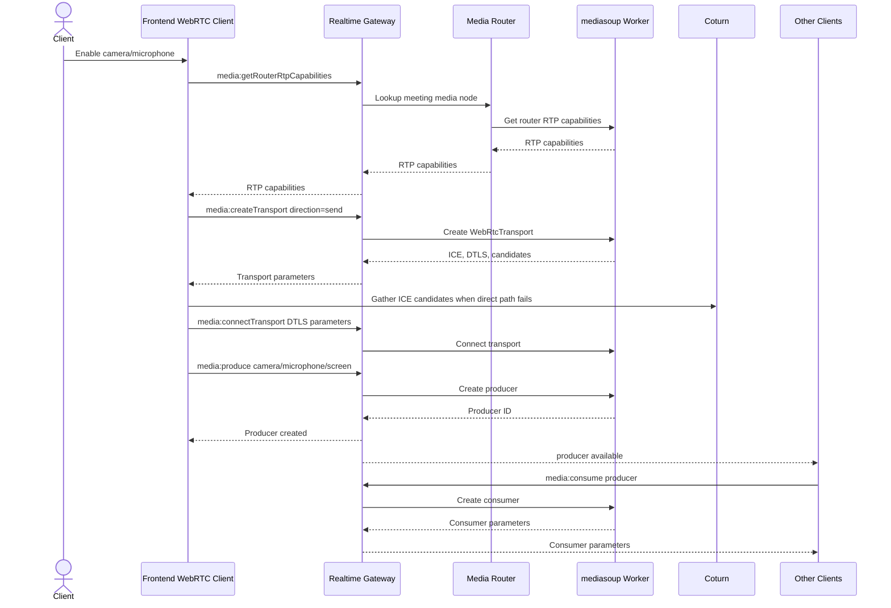

# NovaMeet — Phase 1 Architecture

## 1. Complete System Architecture

NovaMeet is a cloud-native SaaS video conferencing platform with separate user-facing web, API, realtime signaling, media, storage, analytics, and operations planes. The architecture prioritizes stateless application services, horizontally scalable realtime infrastructure, isolated media forwarding, strong tenant/user security, and observable production operations.

### Core architecture principles

- **Stateless API tier**: REST services do not store process-local user/session state. PostgreSQL stores durable data; Redis stores ephemeral state, caches, rate-limit counters, and pub/sub fanout.
- **Dedicated realtime tier**: Socket.io gateways handle meeting presence, chat, host controls, whiteboard/poll events, and WebRTC signaling. Gateways scale horizontally with Redis pub/sub adapters.
- **Dedicated media tier**: mediasoup workers provide SFU media forwarding. Media nodes are separated from API nodes to isolate CPU/network-intensive workloads.
- **Object storage for large artifacts**: S3-compatible storage stores avatars, chat files, whiteboard exports, and recordings. PostgreSQL stores metadata and authorization records.
- **Defense in depth**: RBAC, JWT access tokens, refresh-token rotation, audit logging, rate limiting, input validation, security headers, tenant-aware authorization, and isolated secrets.
- **Operational visibility**: OpenTelemetry traces, Prometheus metrics, Loki logs, Grafana dashboards, and Sentry exception telemetry are treated as first-class production dependencies.



## 2. Monorepo Structure

The monorepo separates deployable applications from reusable internal packages and infrastructure assets. Application services must remain independently deployable even when developed in one repository.

```text
novameet/
  apps/
    frontend/                  # Next.js web client: landing, auth, dashboard, meeting room, playback
    backend/                   # NestJS REST API: auth, users, meetings, recordings, admin, billing-ready boundaries
    realtime/                  # Socket.io gateways: meeting presence, chat, host controls, signaling
    media-router/              # Scheduler/control plane for assigning meetings to mediasoup nodes
    media-worker/              # mediasoup SFU runtime process
    workers/                   # Background jobs: email, recording processing, analytics aggregation

  packages/
    types/                     # Shared TypeScript contracts and event schemas
    shared/                    # Shared constants, validation helpers, domain utilities
    ui/                        # shadcn/ui-compatible React components
    config/                    # Shared eslint, tsconfig, prettier, tailwind presets
    observability/             # Shared OpenTelemetry/logger setup
    security/                  # Shared authz helpers, RBAC policy definitions

  infra/
    docker/                    # Local Docker Compose and Dockerfiles
    kubernetes/                # Raw Kubernetes manifests for platform components
    helm/                      # Helm charts for production releases
    monitoring/                # Prometheus, Grafana, Loki, alerting dashboards
    terraform/                 # Cloud resources: VPC, clusters, DBs, buckets, DNS, IAM

  docs/
    architecture/              # Architecture decision records and diagrams
    api/                       # OpenAPI, websocket event catalog, error model
    runbooks/                  # Operations, incident response, scaling, backup/restore

  tests/
    e2e/                       # Browser E2E tests
    integration/               # API + database integration tests
    load/                      # k6/Gatling load tests for APIs, websockets, and joins
    security/                  # SAST/DAST policy tests and dependency audit configuration
```

### Ownership model

- `apps/frontend`: frontend team owns user experience, device UX, meeting room shell, admin dashboards, and playback pages.
- `apps/backend`: backend platform team owns durable domain APIs, database consistency, RBAC, audit logging, and OpenAPI contracts.
- `apps/realtime`: realtime team owns Socket.io events, meeting presence, chat fanout, whiteboard sync, polls, and signaling orchestration.
- `apps/media-router` and `apps/media-worker`: media platform team owns SFU scheduling, mediasoup lifecycle, RTP settings, TURN integration, and bandwidth optimization.
- `apps/workers`: platform team owns asynchronous workflows including email verification, password recovery, recording processing, and analytics aggregation.
- `infra/*`: DevOps/SRE owns cluster topology, Helm releases, observability, autoscaling, backups, and secrets management.

## 3. Service Boundaries

### Frontend Web App

Responsibilities:

- Public marketing site.
- Registration, login, email verification, password recovery, Google OAuth initiation.
- User dashboard, meeting scheduling, settings, analytics views.
- Meeting room UI for camera, microphone, screen share, chat, participants, polls, whiteboard, recording, and host controls.
- Recording playback pages.

Non-responsibilities:

- No durable authorization decisions.
- No long-lived secret storage.
- No direct database or S3 write access except through signed URLs created by backend services.

### Backend API

Responsibilities:

- Auth lifecycle: registration, login, refresh, logout, email verification, password recovery, OAuth callback handling.
- User management: profile, settings, preferences, status.
- Meeting lifecycle: create, schedule, update, cancel, start, end, lock, participant state persistence.
- Durable chat history, attachments metadata, recordings metadata, polls, votes, analytics, audit logs.
- RBAC enforcement and authorization checks.
- OpenAPI contract and API error consistency.

Non-responsibilities:

- No media packet forwarding.
- No process-local meeting state required for correctness.
- No direct browser WebRTC negotiation except via realtime signaling service.

### Realtime Gateway

Responsibilities:

- Authenticated Socket.io connections.
- Meeting presence and participant roster updates.
- WebRTC signaling messages between clients and media-router/media-workers.
- Realtime chat, private messages, reactions, unread counters.
- Host control broadcasts: mute, remove, lock, disable chat, disable screen share.
- Whiteboard cursor and drawing events.
- Poll start/vote/result events.

Non-responsibilities:

- No permanent source of truth for meeting records.
- No media forwarding.
- No direct object storage writes without backend-issued authorization.

### Media Router

Responsibilities:

- Assign a meeting to an appropriate mediasoup worker node.
- Track media-node capacity: CPU, memory, network throughput, worker count, active rooms, producers, consumers.
- Create and destroy mediasoup rooms/routers through authenticated control channels.
- Maintain Redis-backed room-to-node mappings.

Non-responsibilities:

- No user profile or billing data.
- No UI-facing REST domain APIs.

### Media Worker

Responsibilities:

- Run mediasoup workers and routers.
- Create WebRTC transports, producers, consumers, and data channels.
- Support camera, microphone, screen sharing, simulcast, adaptive bitrate, and consumer pause/resume policies.
- Emit metrics for bitrate, packet loss, RTT, jitter, active transports, producers, and consumers.

Non-responsibilities:

- No durable meeting history storage.
- No direct auth session management.

### Background Workers

Responsibilities:

- Email verification and password recovery emails.
- Recording finalization, transcoding, thumbnail creation, and S3 upload verification.
- Analytics rollups for active users, meeting duration, peak concurrency, and recording usage.
- Retention jobs for expired sessions, old audit logs, and deleted recordings.

## 4. Database Architecture

PostgreSQL is the durable source of truth. The schema is designed around high-volume meeting reads/writes, secure session handling, and auditability.

### Primary domains

- **Users**: identity, profile, preferences, OAuth links, role, status.
- **Sessions**: refresh token hash, expiration, revocation, device/IP metadata.
- **Meetings**: title, description, schedule, type, status, password hash, host, recurrence metadata.
- **MeetingParticipants**: join/leave timestamps, role, mute/camera/screen state snapshots.
- **MeetingSettings**: waiting room, recording, chat, screen sharing, lock state.
- **Messages**: public/private chat messages, reactions, deletion markers.
- **Attachments**: metadata for S3-backed files.
- **Recordings**: lifecycle status, duration, storage key, start/stop times.
- **Polls/PollVotes**: poll definitions, options, votes, realtime results source.
- **AuditLogs**: immutable security and administrative event trail.

### Scaling strategy

- **Primary database** handles writes and strongly consistent reads.
- **Read replicas** serve dashboard analytics, admin reports, and historical meeting views.
- **Connection pooling** through PgBouncer prevents connection exhaustion under bursty websocket/API traffic.
- **Partitioning candidates**: `AuditLogs`, `Messages`, `MeetingParticipants`, and analytics rollups by month or tenant.
- **Indexes** prioritize meeting timelines, host dashboards, participant lookup, session expiry, and audit investigation.
- **Backups** use point-in-time recovery with encrypted snapshots and restore drills.

### Transaction boundaries

- Creating a meeting persists `Meeting` and `MeetingSettings` in one transaction.
- Joining a meeting persists `MeetingParticipant` and emits a realtime event after successful commit.
- Starting/stopping recording updates `Recording` and audit log in one transaction, while media file processing continues asynchronously.
- Poll voting enforces uniqueness per user per poll at the database layer.

## 5. WebRTC Architecture

NovaMeet uses WebRTC for realtime audio, video, and screen sharing. Browser clients publish media to mediasoup SFU nodes rather than directly to every participant, enabling large meetings with lower client CPU and bandwidth usage.

### Client media capabilities

- Camera stream with simulcast encodings.
- Microphone stream with echo cancellation, noise suppression, automatic gain control, and voice activity detection.
- Screen share stream with separate producer lifecycle.
- Reconnect logic for ICE restarts, websocket reconnects, and transport re-creation.
- Bandwidth optimization by pausing offscreen consumers and lowering layers for minimized tiles.

### WebRTC transport model

- Each client creates a **send transport** for microphone/camera/screen producers.
- Each client creates a **receive transport** for subscribed consumers.
- ICE uses STUN first and TURN relay fallback through Coturn.
- DTLS secures transport negotiation.
- SRTP secures media packets.

### Meeting media topology



## 6. mediasoup Architecture

mediasoup is the SFU layer. A mediasoup node may run multiple worker processes. Each worker owns routers, transports, producers, and consumers.

### mediasoup object model

- **Worker**: operating-system process created by the media-worker service. Multiple workers per node map to CPU cores.
- **Router**: per-meeting media routing context with configured RTP codecs.
- **WebRtcTransport**: ICE/DTLS transport for a participant send or receive direction.
- **Producer**: participant media source: microphone, camera, or screen share.
- **Consumer**: participant subscription to another participant's producer.
- **DataProducer/DataConsumer**: optional low-latency data channels for selected realtime features when appropriate.

### Room assignment

1. Realtime gateway receives a meeting join request.
2. Gateway asks media-router for the assigned media node.
3. Media-router returns existing room mapping from Redis or selects a node using capacity-aware scheduling.
4. Media-worker creates a mediasoup router if the room does not exist.
5. Client negotiates send/receive transports through signaling events.
6. Producers and consumers are created based on permissions, viewport, and bandwidth state.

### Scaling and resilience

- **Node selection** considers active rooms, participant count, producer count, CPU, memory, egress throughput, and health.
- **Room stickiness** keeps one meeting on one media node for simple routing and predictable latency.
- **Large-meeting expansion** can use cascading SFU or selective forwarding shards as a future architecture extension.
- **Failure handling** triggers websocket reconnect, media-router reassignment, ICE restart, and participant state reconciliation.
- **Autoscaling** uses CPU, network egress, active transports, and packet-loss metrics rather than HTTP request count.

## 7. Redis Architecture

Redis is the ephemeral coordination layer. It is not the durable source of truth for meetings or users.

### Redis responsibilities

- Socket.io adapter pub/sub across realtime gateway replicas.
- Meeting presence sets and participant heartbeat state.
- Room-to-media-node mappings.
- Rate limiting counters for auth, meeting joins, chat, and uploads.
- Short-lived email verification/password reset tokens when not stored in PostgreSQL.
- Distributed locks for idempotent recording start/stop and media-room creation.
- Job queues for asynchronous workers.
- Cache for frequent read models such as meeting settings and user permissions.

### Redis data patterns

```text
presence:meeting:{meetingId}             Set of active participant connection IDs
presence:user:{userId}                   Set of active socket IDs
meeting:{meetingId}:media-node           Assigned mediasoup node ID with TTL heartbeat
rate-limit:{scope}:{identifier}          Sliding-window or token-bucket counters
lock:recording:{meetingId}               Distributed lock for recording transitions
cache:meeting-settings:{meetingId}       JSON cache with short TTL
queue:recording-processing               Recording processing jobs
socket.io#/#meetings                     Socket.io adapter pub/sub channels
```

### Redis HA

- Production uses Redis Cluster or managed Redis with multi-AZ failover.
- Cache keys must tolerate eviction.
- Critical state has PostgreSQL fallback or media-worker reconciliation.
- Pub/sub reconnects must trigger roster and meeting-state resync.

## 8. S3 Architecture

S3-compatible storage is used for binary and large objects. The application never stores large files in PostgreSQL.

### Buckets/prefixes

```text
novameet-avatars/{userId}/{objectId}
novameet-attachments/{meetingId}/{messageId}/{objectId}
novameet-recordings/{meetingId}/{recordingId}/source.webm
novameet-recordings/{meetingId}/{recordingId}/playback.mp4
novameet-recordings/{meetingId}/{recordingId}/thumbnail.jpg
novameet-whiteboards/{meetingId}/{exportId}.png
```

### Upload/download model

- Backend validates authorization and file policy.
- Backend issues short-lived pre-signed upload URLs.
- Client uploads directly to S3-compatible storage.
- Backend confirms object metadata and persists database record.
- Downloads use short-lived signed URLs or authenticated streaming endpoints.
- Recordings use lifecycle policies for retention, legal hold, and archival tiers.

### Security controls

- Private buckets by default.
- Server-side encryption enabled.
- Per-environment bucket separation.
- Object keys are generated identifiers, never raw user filenames.
- Malware scanning pipeline for uploaded attachments.
- Strict content-type and size constraints.

## 9. Security Architecture

NovaMeet uses layered controls across identity, transport, application, data, and operations.

### Identity and access

- Email/password registration with strong password policy.
- Google OAuth for federated login.
- Email verification before trusted-account actions.
- JWT access tokens with short expiration.
- Refresh-token rotation with hashed refresh tokens stored server-side.
- Logout revokes refresh sessions.
- RBAC roles: Guest, User, Host, Admin, Super Admin.
- Meeting-scoped roles: attendee, host, co-host, guest.

### Authorization model

- API authorization is enforced server-side using resource-level policies.
- Host controls require meeting host/co-host/admin privileges.
- Admin dashboard endpoints require Admin or Super Admin.
- Recording download requires host/admin permission or explicit share policy.
- Private messages require sender and recipient membership in the meeting.

### Application security

- DTO validation and schema validation on every API and websocket event.
- Rate limiting for auth, refresh, meeting joins, chat, uploads, and signaling churn.
- CSRF protection for cookie-based flows.
- XSS protection through React escaping, content sanitization, and strict Content Security Policy.
- Security headers: HSTS, CSP, X-Frame-Options/frame-ancestors, Referrer-Policy, Permissions-Policy.
- Audit logging for auth events, host controls, admin actions, recording access, and security-sensitive mutations.

### Data security

- TLS everywhere for external and internal service traffic where supported.
- PostgreSQL encryption at rest and encrypted backups.
- S3 server-side encryption.
- Secrets stored in Kubernetes Secrets or external secret manager, not in images or source.
- PII minimization in logs; sensitive values are redacted before logging.

### WebRTC security

- DTLS-SRTP media encryption.
- TURN credentials are short-lived.
- Meeting passwords are hashed.
- Waiting room and meeting lock prevent unauthorized entry.
- Signaling events are authenticated and authorized.
- Media producers/consumers are validated against meeting membership and host policies.

## 10. Kubernetes Deployment Architecture

NovaMeet deploys to Kubernetes with independent workloads for frontend, backend, realtime, media-router, media-worker, background workers, observability, and supporting infrastructure.

### Workloads

- **frontend Deployment**: horizontally scaled Next.js pods behind ingress/CDN.
- **backend Deployment**: stateless NestJS REST pods with HPA based on CPU, latency, and request rate.
- **realtime Deployment**: Socket.io pods with sticky sessions at ingress and Redis adapter for cross-pod events.
- **media-router Deployment**: control-plane service for room placement and media node assignment.
- **media-worker DaemonSet or Deployment**: mediasoup nodes with host networking or carefully mapped UDP port ranges.
- **worker Deployment**: background jobs for email, recording processing, and analytics.
- **migration Job**: runs Prisma migrations before application rollout.
- **observability stack**: Prometheus, Grafana, Loki, OpenTelemetry Collector, alertmanager.

### Deployment topology



### Kubernetes production requirements

- PodDisruptionBudgets for frontend, backend, realtime, and media-router.
- HPA for frontend/backend/realtime/workers.
- Custom autoscaling signals for media workers based on active transports and network egress.
- Readiness/liveness probes for all services.
- Resource requests/limits for predictable scheduling.
- Node pools dedicated to media workloads with enhanced networking.
- NetworkPolicies restricting database, Redis, and media control-plane access.
- Rolling deployments for stateless services.
- Controlled drain strategy for media workers so active meetings are not abruptly terminated.
- ExternalDNS and cert-manager for automated DNS/TLS.
- External Secrets Operator or cloud secret manager integration.

## Mermaid Diagrams

### System Architecture



### User Flow



### Meeting Flow

```mermaid
sequenceDiagram
  actor Host
  actor Participant
  participant Web as Frontend
  participant API as Backend API
  participant RT as Realtime Gateway
  participant MR as Media Router
  participant SFU as mediasoup Worker
  participant DB as PostgreSQL
  participant Redis as Redis

  Host->>Web: Create meeting
  Web->>API: POST /meetings
  API->>DB: Persist meeting + settings
  API-->>Web: Meeting details
  Host->>Web: Start meeting
  Web->>RT: meeting:join
  RT->>API: Authorize host membership
  RT->>MR: Resolve media node
  MR->>Redis: Set room-to-node mapping
  MR->>SFU: Create router if needed
  RT-->>Web: Join accepted + media parameters
  Participant->>Web: Join meeting
  Web->>RT: meeting:join
  RT->>API: Validate password/waiting room/member policy
  API->>DB: Persist participant join
  RT->>Redis: Update presence
  RT-->>Host: Participant joined/waiting
  RT-->>Participant: Join accepted
```

### WebRTC Signaling Flow


